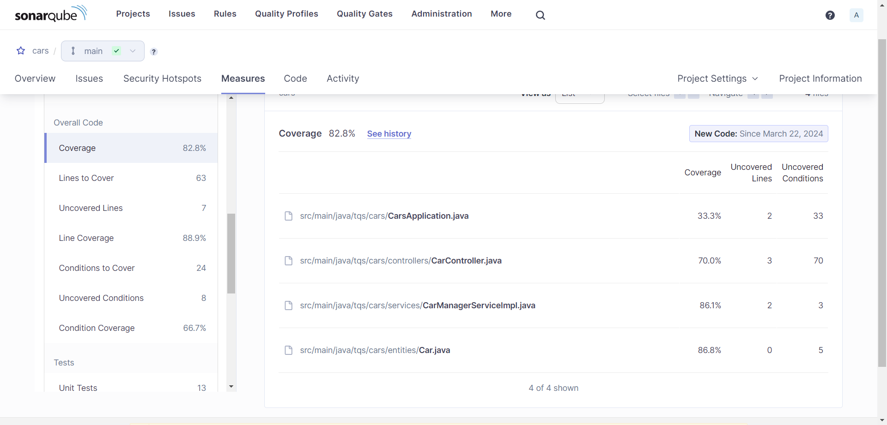

# Technical Debt

Technical debt, in the SonarQube context, is a measure of how much work is needed to fix all the maintainability issues in the project. It is measured in time, and it is calculated based on the estimated time to fix all the issues.

The technical debt in the project is 39 minutes.

# Coverage

The coverage of the project is 82,8%.

There are a total of 7 uncovered lines, and 111 uncovered conditions (although only 8 appear in the sidebar).

While the coverage, being above 80%, is good, there are still some parts of the code that are not being tested. More specifically, there are a lot of conditions that are not being tested, which could lead to bugs in the future.

