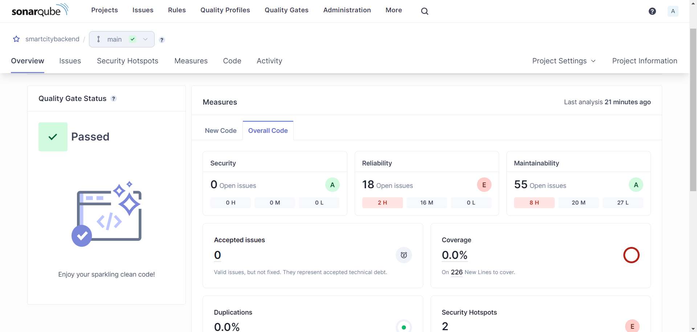
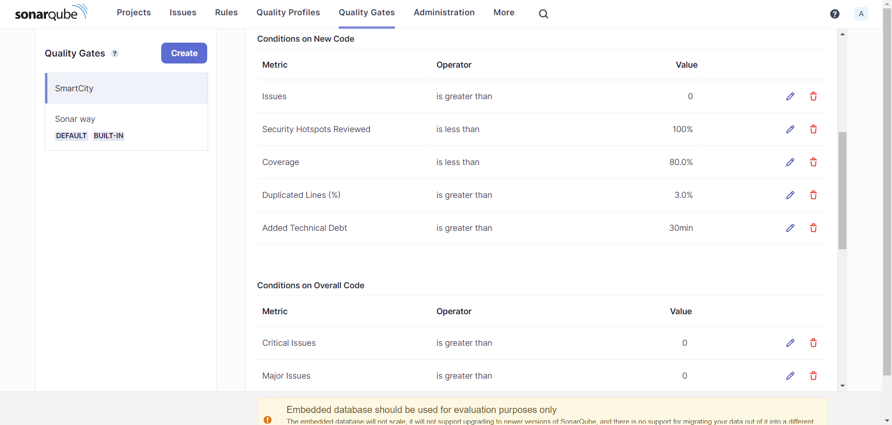
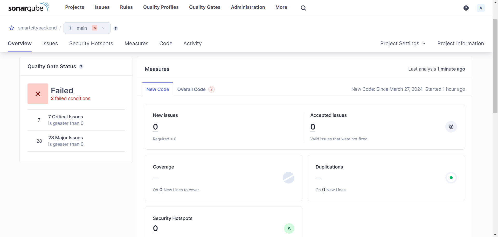

# Smart City Project - Static Analysis

## Description

For this exercise, I chose the backend portion of my IES project, the Smart City project.

## Initial Analysis

The initial analysis of the project showed that there were a lot of issues with the code.

However, even though there are a lot of issues, the code passed the quality gate, according to the standard "sonar way" profile.

## Custom Quality Gate

I created a custom quality gate, called "SmartCity", that has the following conditions:

The quality gate is based on the "sonar way" profile (in order to comply with the "Clean as You Code" methodology), but with some additional conditions.

In order to pass the quality gate, the new code must not have over 30 minutes of technical debt, because the project already has a lot of issues that need to be fixed, and adding more issues would only make the project harder to maintain.

Additionally, there mustn't be any critical nor major issues in the code, because if the project is supposed to be deployed in a real-world scenario, it must be as bug-free as possible.

## Results

After running the analysis with the new quality gate, the project failed the quality gate, due to the ammount of critical and major issues.

